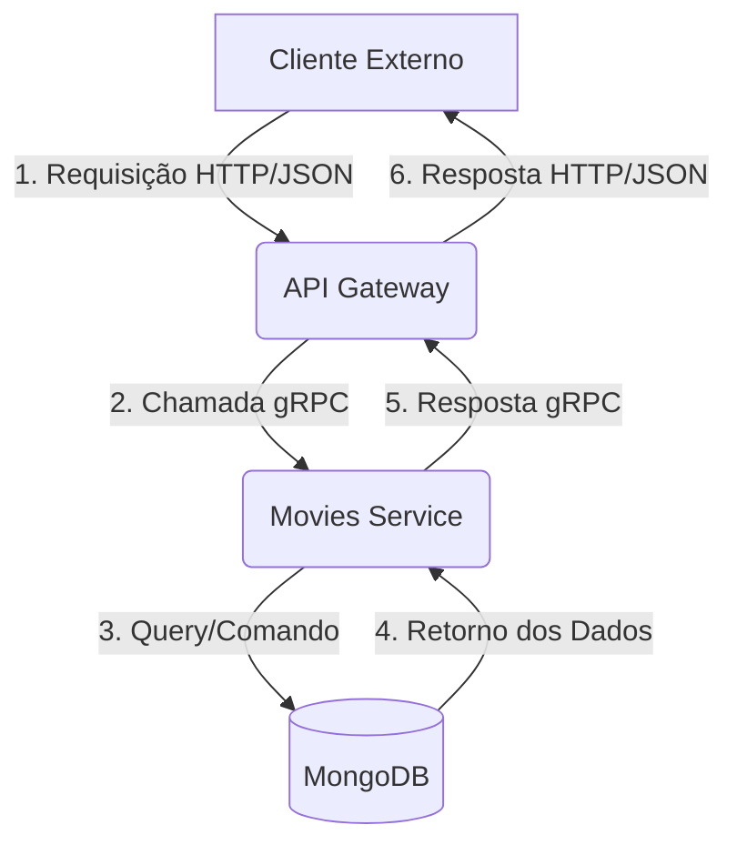

# Movies-microservices

# Microsserviços de Gerenciamento de Filmes em Go


Este repositório contém a implementação de um sistema de microsserviços para gerenciar uma coleção de filmes, desenvolvido como solução para um teste técnico. O projeto demonstra a aplicação de conceitos de arquitetura distribuída, comunicação inter-serviços com gRPC, containerização com Docker e boas práticas de desenvolvimento em Go.

## 🛠️ Tecnologias Utilizadas

* **Linguagem:** Go 1.24
* **Banco de Dados:** MongoDB
* **Comunicação:** gRPC / Protocol Buffers
* **API Gateway:** REST (net/http + gorilla/mux)
* **Containerização:** Docker & Docker Compose
* **Testes:** Testes Unitários Nativos do Go
* **Documentação da API:** Swagger (OpenAPI)

## 🏛️ Arquitetura do Sistema

O projeto utiliza uma arquitetura de microsserviços com comunicação via gRPC, garantindo baixo acoplamento e alta performance. O núcleo do serviço de domínio foi implementado seguindo os princípios da **Arquitetura Hexagonal (Portas e Adaptadores)**.



* **API Gateway:** Responsável por expor uma API REST ao mundo e traduzir as requisições para gRPC.
* **Movies Service:** Contém toda a lógica de negócio isolada e é o único serviço que se comunica com o banco de dados.
* **MongoDB:** Banco de dados NoSQL para persistência dos dados, com seus dados persistidos através de um volume Docker.

## 🚀 Como Executar

O ambiente completo é orquestrado com Docker Compose, permitindo que toda a aplicação (dois microsserviços + banco de dados) seja iniciada com um único comando.

### Pré-requisitos
* [Docker](https://www.docker.com/products/docker-desktop/)
* [Docker Compose](https://docs.docker.com/compose/install/)
* [Git](https://git-scm.com/)

### Passos para Execução
1.  Clone o repositório:
    ```bash
    git clone https://github.com/alenrique/Movies-microservices.git
    ```
2.  Navegue até a pasta do projeto:
    ```bash
    cd Movies-microservices
    ```
3.  Execute o Docker Compose para construir as imagens e iniciar os containers:
    ```bash
    docker-compose -p henrique-alencar-movies-app up --build
    ```
O `-p henrique-alencar-movies-app` significa que os nomes dos containers irão começar com `henrique-alencar-movies-app` para evitar conflito com outros containers de nomes iguais, com esse comando irá subir os containers com nomes: 
* `henrique-alencar-movies-app_mongodb_1`
* `henrique-alencar-movies-app_movies-service_1`
* `henrique-alencar-movies-app_api-gateway_1`.

Após os logs estabilizarem, a API estará disponível em `http://localhost:8080/movies`.

## 📖 Documentação e Endpoints da API

A documentação completa e interativa da API está disponível via **Swagger UI**. Após iniciar a aplicação, acesse:

* **[http://localhost:8080/swagger/index.html](http://localhost:8080/swagger/index.html)**

### Exemplos de Uso com `curl`

#### 1. Listar Todos os Filmes
```bash
curl http://localhost:8080/movies
```

#### 2. Criar um Novo Filme
```bash
curl -X POST http://localhost:8080/movies \
-H "Content-Type: application/json" \
-d '{"title": "Interestelar", "director": "Christopher Nolan", "year": 2014}'
```

#### 3. Buscar Filme por ID
```bash
# Substitua '{id}' por um ID válido retornado na listagem
curl http://localhost:8080/movies/{id}
```

#### 4. Deletar um Filme
```bash
# O -v mostra os cabeçalhos da resposta, incluindo o status 204
curl -v -X DELETE http://localhost:8080/movies/{id}
```

## ✅ Testes

O projeto inclui testes unitários para o núcleo de negócio do `movies-service`, garantindo a qualidade e o comportamento esperado da lógica principal.

Para executar os testes, rode o seguinte comando na raiz do projeto:
```bash
go test ./...
```
