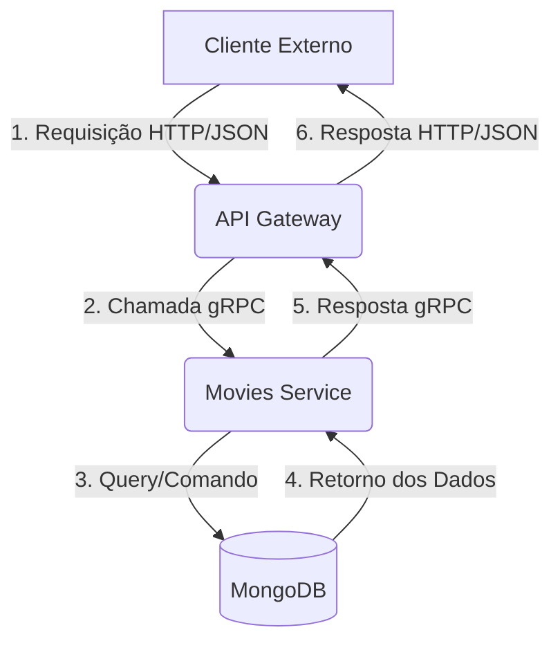

# Arquitetura do Sistema - Gerenciamento de Filmes

**Data:** 28 de Agosto de 2025
**Autor:** Henrique Alencar

## 1. Visão Geral

Este projeto foi construído utilizando uma **Arquitetura de Microsserviços**, projetada para garantir separação de responsabilidades, escalabilidade e manutenibilidade. O sistema é composto por três componentes principais que operam de forma independente, mas se comunicam através de uma rede definida: um **API Gateway**, um **Serviço de Domínio de Filmes** e um **Banco de Dados**.

A comunicação entre os serviços é realizada via **gRPC**, um protocolo de alta performance ideal para comunicação interna, enquanto a comunicação com o mundo exterior é feita através de uma **API REST** convencional.

## 2. Diagrama da Arquitetura

O fluxo de uma requisição através do sistema segue o padrão abaixo:

## 3. Componentes do Sistema

### 3.1. API Gateway (api-gateway)

Responsabilidade: É a única porta de entrada para o sistema. Ele expõe uma API RESTful para os clientes externos. Sua função é receber requisições HTTP, traduzi-las para chamadas gRPC e encaminhá-las ao serviço interno apropriado. Ele também é responsável por traduzir as respostas gRPC de volta para HTTP/JSON.

**Tecnologias:**

* Linguagem: Go

* Servidor HTTP: net/http

* Roteador: gorilla/mux

* Comunicação: Cliente gRPC para Go

### 3.2. Serviço de Filmes (movies-service)

Responsabilidade: É o cérebro do sistema. Contém toda a lógica de negócio relacionada ao domínio de "Filmes". Ele é o único componente que tem permissão para acessar o banco de dados. Este serviço não é exposto diretamente à internet; ele apenas aceita conexões gRPC vindas de dentro da sua rede (neste caso, do API Gateway).

**Tecnologias:**

* Linguagem: Go

* Servidor gRPC: google.golang.org/grpc

* Comunicação com DB: mongo-driver

### 3.3. Banco de Dados (MongoDB)

* Responsabilidade: Persistência dos dados. Armazena a coleção de documentos de filmes. É acessado exclusivamente pelo movies-service.

* Tecnologia: Imagem Docker oficial do mongo.

## 4. Arquitetura do Código (movies-service)

O núcleo de negócio (movies-service) foi modelado utilizando a Arquitetura Hexagonal (Portas e Adaptadores). Esta abordagem garante que a lógica de negócio (o "hexágono") permaneça completamente isolada de detalhes de infraestrutura, como o banco de dados ou o protocolo de comunicação.

* **Núcleo de Domínio (/service):** Contém a lógica de negócio pura e as definições das "Portas" (interfaces MovieService e MovieRepository). Ele não tem nenhuma dependência de pacotes externos de frameworks ou bancos de dados.

* **Portas (Interfaces):**

    * **Porta de Entrada (MovieService):** Define o que a aplicação oferece (ex: CreateMovie). É implementada pelo núcleo.

    * **Porta de Saída (MovieRepository):** Define o que a aplicação precisa (ex: Save). É implementada pelos adaptadores.

* **Adaptadores (/database, /grpc_adapter):**

    * **Adaptador de gRPC (grpc_adapter):** É um adaptador de entrada. Ele traduz as chamadas gRPC recebidas para chamadas de métodos na porta MovieService.

    * **Adaptador de MongoDB (database):** É um adaptador de saída. Ele implementa a interface MovieRepository, traduzindo as necessidades do núcleo em comandos específicos do MongoDB.

## 5. Containerização e Orquestração

* **Docker:** Cada microsserviço ( api-gateway e movies-service) possui seu próprio Dockerfile que utiliza um build multi-estágio para criar imagens de produção otimizadas, pequenas e seguras.

* **Docker Compose:** O arquivo docker-compose.yml na raiz do projeto orquestra todo o ambiente. Ele é responsável por:

    1. Construir as imagens dos dois serviços Go.

    2. Iniciar os três containers (MongoDB, movies-service, api-gateway).

    3. Configurar uma rede virtual (movies-net) para que os containers possam se comunicar usando seus nomes de serviço (ex: mongodb:27017).

    4. Definir as dependências de inicialização (depends_on) para garantir que o banco de dados inicie antes dos serviços.

    5. Mapear as portas necessárias para a máquina host (8080 e 27017).

    6. Configurar um volume Docker (mongo-data) para garantir a persistência dos dados do MongoDB entre as execuções.
